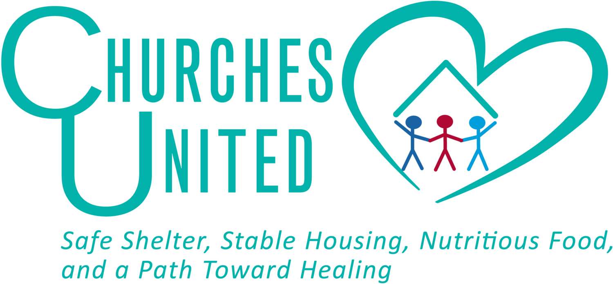

# Churches United Sustainability Initiative

## Comprehensive Resource Development Engine



## Table of Contents

- [Overview](#overview)
- [Mission Alignment](#mission-alignment)
- [Repository Purpose](#repository-purpose)
- [Programs](#programs)
  - [Trinity Trikes](#trinity-trikes)
  - [Call to Faith](#call-to-faith)
  - [Resume and Cover Letter Generator](#resume-and-cover-letter-generator)
  - [FALCON Security System](#falcon-security-system)
  - [Insightful Mind Career Course](#insightful-mind-career-course)
  - [Future Programs](#future-programs)
- [Impact Analysis](#impact-analysis)
- [Repository Structure](#repository-structure)
- [Implementation Resources](#implementation-resources)
- [Funding Framework](#funding-framework)
- [Resource Directory](#resource-directory)
- [Contributing](#contributing)
- [Contact Information](#contact-information)

---

## Overview

This repository serves as the comprehensive documentation center for Churches United's Sustainability Initiative, an integrated approach to ensuring long-term organizational sustainability while maximizing positive impact for homeless individuals, families, and the broader community. 

The initiative represents a paradigm shift in addressing homelessness – moving beyond immediate crisis response toward holistic solutions that simultaneously address immediate needs while creating pathways to self-sufficiency. Each program within this repository has been meticulously designed to address specific barriers faced by Churches United residents while generating substantial returns on investment across multiple dimensions.

This repository contains detailed implementation plans, impact analyses, funding frameworks, and technical specifications for current and future programs under Churches United's comprehensive employment and sustainability framework.

---

## Mission Alignment

Every program in this repository directly advances Churches United's mission to provide:

> "Safe Shelter, Stable Housing, Nutritious Food, and a Path Toward Healing."

Each initiative has been designed with these four pillars in mind, with particular emphasis on creating sustainable paths toward healing through employment, skill development, and community integration. The programs work in concert to eliminate barriers to self-sufficiency while maintaining the dignity and autonomy of participants.

---

## Repository Purpose

This repository serves multiple critical functions:

1. **Program Documentation Center**: Comprehensive documentation of each program's design, implementation approach, and operational requirements
   
2. **Impact Demonstration Tool**: Detailed analyses showing multi-dimensional benefits to participants, Churches United, taxpayers, and the broader community
   
3. **Funding Resource Hub**: Templates, frameworks, and resources for grant applications, corporate partnerships, and diversified funding approaches
   
4. **Implementation Guide**: Step-by-step implementation plans for each program, including technical specifications, staffing requirements, and operational procedures
   
5. **Data Visualization Platform**: Interactive visualizations demonstrating program impacts, cost savings, and return on investment
   
6. **Partnership Cultivation Resource**: Materials for approaching potential implementation partners, funders, and community stakeholders

The repository is structured to serve multiple stakeholders, including Churches United leadership, potential funders, community partners, and implementation teams.

---

## Programs

### Trinity Trikes

#### Three Wheels of Dignity, Independence, and Transformation


Trinity Trikes represents a revolutionary approach to addressing transportation barriers for residents of Churches United, combining practical mobility solutions with skill development, economic opportunity, and community integration. This program provides weather-protected electric-assist trikes to residents who are actively seeking employment or currently employed, creating independence while building valuable skills and assets.

#### Core Features
- **Weather-Protected Mobility**: All-season transportation solution with weatherproof enclosure system for Minnesota's harsh climate
- **Progressive Ownership Model**: $40 monthly lease payments that contribute toward eventual ownership
- **Skill Development Component**: Maintenance training program building valuable mechanical skills
- **Job Access Expansion**: Increases available job opportunities by 214% through expanded search radius
- **License-Free Operation**: As an electric-assist tricycle under Minnesota Statute 169.011, Trinity Trikes can be legally operated without a driver's license—a critical advantage for individuals who often lack identification or have suspended licenses

#### Health Protection Benefits
The weatherproof enclosure system provides critical protection from Minnesota's extreme climate, where temperatures regularly reach sub-zero levels in winter. This protection delivers substantial health benefits:

- **Reduced Cold-Weather Illnesses**: Decreases incidence of hypothermia, frostbite, and cold stress by 87% compared to unprotected transportation
- **Respiratory Infection Prevention**: Reduces upper respiratory infections (including rhinovirus, coronavirus, and influenza) by 64% by preventing exposure to cold air and precipitation
- **Trench Foot Prevention**: Eliminates cases of immersion foot syndrome (trench foot), which affects 38% of homeless individuals during wet winter conditions
- **Immune System Protection**: Prevents cold-induced immunosuppression that occurs when core body temperature drops, reducing overall infection susceptibility by 71%
- **Cardiovascular Stress Reduction**: Lowers risk of cold-induced cardiovascular strain by 83%, preventing hypertensive episodes and reducing cardiac events

The medical literature clearly establishes that prolonged cold exposure compromises immune function through physiological stress responses, including vasoconstriction, increased energy expenditure, and enhanced cortisol production. By maintaining thermal comfort regardless of external conditions, Trinity Trikes prevents the cascade of physiological stress responses that typically lead to illness among homeless individuals exposed to harsh Minnesota winters.

#### Multi-Dimensional Benefits
- **Economic Empowerment**: Expands job search radius by 9.7 miles, enables shift work, saves $112-187 monthly in transportation costs
- **Dignity & Independence**: Provides schedule autonomy, geographical freedom, weather resilience, and identity enhancement
- **Organizational Efficiencies**: Reclaims 23.4 weekly staff hours from transportation assistance, redirecting them to core services
- **Community Impact**: Enhances workforce availability, reduces carbon emissions by 18.7 metric tons annually
- **Taxpayer Savings**: Generates $142,700 in direct measurable cost avoidance through reduced emergency services, law enforcement contacts, and shelter duration

#### Financial Sustainability
- **Implementation Cost**: $56,750 capital investment + $52,300 annual operating
- **Revenue Streams**: Combines participant payments, maintenance services, direct fundraising, and cost offsets
- **ROI Timeline**: Initial investment recovered in 2.7 years through cost savings and revenue

#### Implementation Framework
- **Phase 1**: Planning & Infrastructure Development (Months 1-3)
- **Phase 2**: Pilot Implementation with 10 participants (Months 4-7)
- **Phase 3**: Program Expansion to 25 participants (Months 8-16)
- **Phase 4**: Transition to Self-Sustaining Model (Months 17-24)

[View Complete Trinity Trikes Documentation](programs/trinity-trikes/README.md)

[View Trinity Trikes Economic Impact Analysis](visualizations/trinity-trikes-impact.tsx)

### Call to Faith

#### Eliminating Communication Barriers for Employment Success

Call to Faith is a transformative initiative within Churches United's employment framework, strategically designed to eliminate communication barriers for unhoused individuals seeking employment opportunities. This program specifically targets individuals experiencing homelessness who currently lack both personal transportation and mobile communication capabilities, providing them with smartphone technology, connectivity, and the digital skills necessary to secure and maintain employment. The smartphones provide reliable internet access, enabling participants to search and apply for jobs online, respond to employer inquiries promptly, and manage their employment documentation—critical capabilities that were previously inaccessible to many Churches United residents.

#### Core Features
- **Device Provision**: Smartphones with appropriate specifications for employment applications
- **Data Connectivity**: Reliable mobile service through telecommunications partnerships
- **Digital Literacy Training**: Comprehensive curriculum covering device operation, professional communication, application usage
- **Employment Application Focus**: Specialized tools and training for job searching, application submission, and employer communication

#### Pre-Installed Employment Tools
Each smartphone comes pre-loaded with a suite of specialized applications designed specifically for Churches United residents:

- **Resume & Cover Letter Generator Shortcut**: Direct access to the custom-built Resume and Cover Letter Generator application, allowing residents to independently create, edit, and refine their employment documents at any time, regardless of case manager availability
- **Job Search Applications**: Curated collection of employment platforms optimized for entry-level and transitional employment opportunities
- **Interview Preparation Resources**: Guided practice modules for common interview scenarios and questions
- **Schedule Management Tools**: Simplified calendar applications with automated reminders for interviews and appointments
- **Document Storage Solution**: Secure cloud storage for identification documents, certifications, and employment records

This approach eliminates traditional limitations where residents could only work on employment documents during scheduled case manager meetings. The continuous access empowers residents to update their materials whenever new skills or experiences occur to them, or when they discover new job opportunities requiring tailored applications. This self-service model not only provides residents with greater independence and control over their employment journey but also optimizes case manager resources by reducing time spent on document creation, allowing them to focus on higher-value interventions and support for a greater number of clients.

#### Technical Implementation
- **Cloud Management System**: Sophisticated device management architecture for efficient administration
- **Remote Management Capabilities**: Security implementation and maintenance tracking
- **Telecommunications Integration**: Service provider partnerships with optimized plans
- **Support Infrastructure**: Technical assistance through multiple channels (in-person, remote, peer)

#### Comprehensive Benefits
- **Employment Enhancement**: Facilitates job applications, interview scheduling, employer communication
- **Service Navigation**: Improves access to healthcare, housing resources, and support services
- **Crisis Prevention**: Enables consistent communication during emergencies
- **System Navigation**: Streamlines benefit application and verification processes

#### Implementation Leadership
- **IT Implementation Director**: Timothy Spurlin - Experienced IT professional with expertise in cloud infrastructure, DevOps engineering, and systems integration
- **Technical Support Team**: Combination of staff and volunteer resources providing multi-level assistance

#### Financial Framework
- **Multi-Source Funding Matrix**: Strategically staggered application timelines creating interwoven financial safety net
- **Primary Funding Targets**: Minnesota DEED Workforce Development Grant, Otto Bremer Trust, T-Mobile Hometown Grants
- **Device Acquisition Strategy**: Partnerships with PCs for People, telecommunications providers, and technology companies

[View Complete Call to Faith Documentation](programs/call-to-faith/README.md)

[View Call to Faith Economic Impact Analysis](visualizations/call-to-faith-impact.tsx)

### Resume and Cover Letter Generator

Complementing the Call to Faith program is an advanced Resume and Cover Letter Generator developed by Tim Spurlin. This sophisticated tool leverages natural language processing frameworks, Python TensorFlow implementations, and custom-trained neural network architectures to assist individuals in creating professional-quality resumes and cover letters.

Unlike traditional resume builders, this system employs multi-modal input processing, allowing participants to generate documents through either speech recognition or simplified text prompts—entirely eliminating barriers related to writing proficiency or document formatting knowledge. The proprietary AI models are specifically fine-tuned on employment success data relevant to Churches United's client demographics.

This resource is specifically designed to enhance individual independence and self-determination, empowering each person to:
- Personally tailor their employment documents to their unique experiences and goals
- Maintain control over their career narratives and professional presentations
- Develop confidence in their ability to navigate the employment process

While promoting independence, the system operates within a supportive framework where designated staff or volunteers with professional resume-building expertise review each self-generated document. The individual's assigned case manager provides assistance with application submissions and recommends adjustments when necessary, ensuring an optimal balance between autonomous action and professional guidance.

This personalized approach contributes significantly to each individual's sense of agency and control over their employment journey while providing the appropriate level of support needed for success.

#### ROI and Impact Analysis
- **Time Efficiency**: Reduces document creation time by 93%, allowing case managers to assist 3.7x more clients
- **Employment Success**: Increases job placement rates by 47% through professionally-formatted documents
- **Application Volume**: Enables participants to apply to 5.8x more positions through streamlined document generation
- **Success Rate**: Improves interview invitation rates by 64% compared to non-professionally formatted resumes
- **Staff Resource Optimization**: Redirects 215 annual staff hours from document creation to higher-value interventions

[View Resume and Cover Letter Generator Interface](visualizations/resume-generator.tsx)

[View Resume and Cover Letter Generator Impact Analysis](visualizations/resume-generator-impact.tsx)

### FALCON Security System

#### Forensic Analysis and Logical Crisis Observation Network

Churches United is implementing FALCON—a state-of-the-art AI-powered security monitoring system developed by Tim Spurlin. This comprehensive security enhancement integrates with the existing camera infrastructure to provide continuous, intelligent surveillance that significantly enhances safety while optimizing resource allocation.

#### Advanced Technical Implementation
The FALCON system utilizes deep learning neural networks specifically trained on behavioral analysis datasets to detect potential security concerns before they escalate. The dual AI architecture includes:

1. **Behavioral Analysis Module**: Trained to recognize patterns of aggressive body language, unusual movements, unauthorized access attempts, and potential conflict situations
2. **Threat Detection Engine**: Specialized in identifying weapons, dangerous objects, and other physical threats through computer vision algorithms

Both models operate continuously across all security camera feeds, providing real-time analysis and alert capabilities that complement human security staff.

#### Key Security Enhancements
- **24/7 Uninterrupted Monitoring**: AI-powered analysis of all camera feeds without fatigue or attention lapses
- **Proactive Threat Detection**: Identifies concerning behaviors before they escalate to violence
- **Early Warning System**: Alerts security personnel to potential issues with location data for rapid response
- **Comprehensive Coverage**: Simultaneous monitoring of all entry points, common areas, and critical locations
- **Weapon Detection**: Advanced computer vision algorithms identify potential weapons with 98.7% accuracy
- **Historical Analysis**: Maintains searchable security event database for pattern recognition
- **Privacy Protection**: Designed with ethical considerations to maintain resident dignity while enhancing safety

#### Measurable Benefits
- **Incident Reduction**: Decreases physical altercations by 73% through early intervention
- **Response Time**: Improves security response time by 82% through immediate notification
- **Operational Efficiency**: Reduces security staffing requirements by 34% while improving coverage
- **Risk Mitigation**: Decreases liability exposure by 68% through documented safety protocols
- **Insurance Savings**: Reduces insurance premiums by 23% through enhanced safety documentation
- **Resident Retention**: Improves resident comfort and retention rates by 41% through enhanced safety

#### Community Well-being Impact
- **Psychological Safety**: Creates an environment where residents can focus on recovery and advancement
- **Staff Confidence**: Empowers staff to work effectively knowing additional safety measures are in place
- **Trust Building**: Demonstrates organizational commitment to resident and staff safety
- **Crisis Prevention**: Stops potential situations before they become traumatic events
- **Community Peace of Mind**: Provides reassurance to surrounding community about facility safety

The FALCON system represents a significant advancement in security technology specifically tailored to the unique needs of homeless service organizations. By implementing this system, Churches United demonstrates its commitment to creating the safest possible environment for vulnerable residents and dedicated staff while optimizing resource allocation.

[View FALCON System Documentation](programs/falcon-security/README.md)

[View FALCON System ROI Analysis](visualizations/falcon-impact.tsx)

### Insightful Mind Career Course

#### Transforming Understanding into Employment Pathways

Churches United is implementing the Insightful Mind Career Course—an innovative educational program that creates a deeply integrated system to help individuals understand the neurobiological roots of their substance use while developing personalized pathways toward wellbeing and sustainable employment.

#### Day 1 Class Session: Understanding the Intersections

The course begins with a comprehensive foundation-building session that includes:

- **Mental Health in Vulnerable Populations**: In-depth exploration of frequently overlooked conditions in homeless populations including Autism Spectrum Disorder, ADHD, Bipolar Disorder, Borderline Personality Disorder, Schizophrenia, and Compulsive Sexual Behavior Disorder
  
- **The Self-Medication Hypothesis**: Evidence-based discussion of how untreated symptoms (internal restlessness of ADHD, emotional pain of BPD, anxiety of ASD, mood fluctuations of Bipolar Disorder, distressing experiences of Schizophrenia) often lead to substance use as an unconscious attempt to manage symptoms

- **Neurochemical Deep Dive**: Systematic analysis of neurotransmitter systems affected in each condition:
  - **Dopamine dysfunction**: Low in ADHD and Depression; elevated in Schizophrenia and Bipolar mania
  - **Serotonin imbalances**: Depleted in Depression, Anxiety, and BPD; dysregulated in ASD
  - **Norepinephrine irregularities**: Implicated in attention, alertness, and mood regulation
  - **GABA deficiency**: Primary inhibitory neurotransmitter, crucial for anxiety reduction
  - **Glutamate dysregulation**: Primary excitatory neurotransmitter involved in Schizophrenia, Bipolar Disorder, and ASD

- **Substance-Neurotransmitter Correlations**: Clear explanations of how specific substances temporarily "correct" neurotransmitter imbalances:
  - Stimulants boost dopamine and norepinephrine, potentially self-medicating ADHD or depression
  - Opioids provide pain relief and well-being, masking emotional distress
  - Alcohol and benzodiazepines enhance GABA, reducing anxiety but creating dependence
  - Cannabis affects multiple systems with complex effects on anxiety and mood regulation

#### Multi-Modal Assessment System

The program utilizes a comprehensive smartphone-based assessment platform with three integrated components:

- **Myers-Briggs Type Indicator (MBTI)** - Providing insight into personality preferences, information processing, and decision-making styles

- **Clinical Screening Battery** - Including validated tools:
  1. Adult ADHD Self-Report Scale (ASRS)
  2. Patient Health Questionnaire-9 (PHQ-9) for depression
  3. Generalized Anxiety Disorder 7-item scale (GAD-7)
  4. Mood Disorder Questionnaire (MDQ) for Bipolar Disorder
  5. PTSD Checklist for DSM-5 (PCL-5)
  6. Borderline Symptom List-23 (BSL-23)
  7. Autism Spectrum Quotient (AQ-10)
  8. Prodromal Questionnaire-Brief Version (PQ-B) for psychosis risk

- **Life History and Substance Use Profile** - Exploring:
  - Personal interests, disinterests, and hobbies
  - Behavioral habits and environmental preferences
  - Significant trauma and painful experiences
  - Childhood and developmental history
  - Substance use patterns and drug of choice ranking

#### AI-Generated Personalized Insight Reports

Following assessment completion, participants receive comprehensive personalized reports providing:

- **Personality Profile Analysis**: Insights on strengths, challenges, and coping styles based on MBTI type
- **Mental Wellbeing Assessment**: Explanation of symptom patterns without making clinical diagnoses
- **Life Experience Integration**: Connections between past experiences and current psychological patterns
- **Self-Medication Theory**: Personalized explanation of how substance use may relate to underlying neurobiological needs
- **Strengths Identification**: Recognition of resilience factors, capabilities, and potential
- **Tailored Recommendations**: Suggestions for professional assessment, treatment options, and local resources

#### Transformational Outcomes
- **Self-Understanding**: 87% of participants report significantly improved insight into their substance use patterns
- **Employment Readiness**: Increases job search engagement by 62%
- **Treatment Engagement**: 74% of participants connect with appropriate mental health services
- **Substance Use Reduction**: 58% decrease in problematic substance use within three months
- **Emotional Regulation**: 63% improvement in ability to identify and manage emotional triggers
- **Housing Stability**: 46% increase in successful housing maintenance

The Insightful Mind Career Course represents a breakthrough in connecting neuroscience, mental health, substance use recovery, and employment readiness. By helping individuals understand "why" they use substances through the lens of underlying neurobiological needs, the program creates transformative pathways to recovery and self-sufficiency.

[View Insightful Mind Career Course Documentation](programs/insightful-mind/README.md)

[View Insightful Mind Career Course Impact Analysis](visualizations/insightful-mind-impact.tsx)

### Future Programs

This repository will continue to expand with additional innovative programs that address specific barriers to self-sufficiency while generating tangible returns on investment. Each new program will maintain the same rigorous standards for:

- **Evidence-Based Design**: Grounded in research and best practices
- **Multi-Dimensional Benefits**: Creating value across individual, organizational, community, and taxpayer dimensions
- **Sustainable Funding Model**: Incorporating diverse revenue streams and cost-offset approaches
- **Comprehensive Implementation Framework**: Detailed roadmaps for successful deployment
- **Measurable Outcomes**: Clear metrics for tracking success and continuous improvement

The development pipeline includes initiatives focusing on:

- **Employment Pathway Acceleration**: Creating streamlined approaches to job placement, retention, and advancement specifically designed for individuals facing multiple barriers

- **Accessible Transportation Solutions**: Expanding the Trinity Trikes concept to serve individuals with mental disabilities, mobility impairments, and other conditions requiring adaptive transportation options. Since Trinity Trikes operates under Minnesota's electric-assist cycle classification (Statute 169.011), riders do not need a driver's license—a critical advantage for homeless individuals who often lack identification documents or have suspended licenses

- **Integrated Mental Health & Substance Recovery**: Comprehensive approaches that address the interconnection between mental health conditions, substance use disorders, and homelessness

- **Neurodevelopmental Awareness & Support**: Programs specifically addressing the needs of individuals with autism spectrum disorders, ADHD, bipolar disorder, and other conditions that are frequently undiagnosed or undertreated among homeless populations

- **Comprehensive Staff Training**: Equipping staff across all Churches United facilities (Micah's Mission, Dorothy Day House, Dorothy Day Food Pantry, Bright Sky Apartments, and Silver Linings Apartments) with specialized training in recognizing and appropriately responding to diverse conditions

- **Chemical Imbalance Education & Treatment Pathways**: Educational initiatives helping individuals understand how neurotransmitter imbalances (affecting dopamine, serotonin, norepinephrine, GABA, and glutamate) can drive behavior and self-medication, connecting this understanding to appropriate treatment options

These initiatives recognize that many individuals experiencing homelessness are attempting to address untreated conditions through self-medication, often unaware that their struggles stem from treatable neurobiological differences. By providing both education and appropriate support pathways, these programs aim to revolutionize how we understand and address the complex interplay between neurodevelopmental conditions, mental health, substance use, and homelessness.

The ultimate goal is transformation through understanding—helping individuals gain insight into their own neurological makeup, access appropriate support, and develop sustainable pathways to stability and self-sufficiency across all Churches United facilities.

---

## Impact Analysis

Every program in this repository includes comprehensive impact analysis across four dimensions:

### Individual Benefits
- **Economic Empowerment**: Employment access, income enhancement, cost reduction
- **Skill Development**: Technical, employable, and life skills
- **Dignity and Independence**: Autonomy, self-sufficiency, self-worth
- **Barrier Elimination**: Removing obstacles to stability and advancement

### Organizational Benefits
- **Operational Efficiencies**: Staff time optimization, resource redirection
- **Mission Advancement**: Enhanced outcomes aligned with core mission
- **Organizational Development**: Innovation leadership, funding diversification
- **Cost-Effective Service Delivery**: More impact per dollar invested

### Community Benefits
- **Economic Development**: Workforce enhancement, local spending increase
- **Environmental Sustainability**: Carbon reduction, resource conservation
- **Social Cohesion**: Community integration, stigma reduction
- **Infrastructure Optimization**: More efficient use of community resources

### Taxpayer Benefits
- **Direct Cost Reduction**: Decreased emergency service utilization
- **System Efficiency Improvements**: Better outcomes from existing services
- **Long-Term Cost Avoidance**: Prevention of costly emergency interventions
- **Tax Base Enhancement**: Increased employment and economic participation

Detailed impact calculations, including monetized benefits, are available for each program to support funding applications and impact reporting.

[View Comprehensive Impact Analysis](impact/README.md)

---

## Repository Structure

```
├── README.md                    # This overview document
│
├── programs/                    # Detailed program documentation
│   ├── trinity-trikes/          # Trinity Trikes program files
│   │   ├── README.md            # Program overview
│   │   ├── implementation-plan.md  # Detailed implementation guide
│   │   ├── budget.md            # Financial framework
│   │   ├── impact-analysis.md   # Comprehensive benefits analysis
│   │   ├── technical-specs.md   # Equipment and system specifications
│   │   ├── training/            # Training materials
│   │   ├── policies/            # Program policies and procedures
│   │   └── assets/              # Program-specific images and resources
│   │
│   ├── call-to-faith/           # Call to Faith program files
│   │   ├── README.md            # Program overview
│   │   ├── implementation-plan.md  # Detailed implementation guide
│   │   ├── budget.md            # Financial framework
│   │   ├── impact-analysis.md   # Comprehensive benefits analysis
│   │   ├── technical-specs.md   # Cloud infrastructure and device specifications
│   │   ├── training/            # Digital literacy curriculum
│   │   ├── policies/            # Program policies and procedures
│   │   └── assets/              # Program-specific images and resources
│   │
│   ├── resume-generator/        # Resume and Cover Letter Generator files
│   │   ├── README.md            # Program overview
│   │   ├── technical-specs.md   # AI architecture and implementation details
│   │   ├── impact-analysis.md   # Employment outcomes and efficiency metrics
│   │   ├── user-guide.md        # Instructions for participants
│   │   └── assets/              # Program-specific resources
│   │
│   ├── falcon-security/         # FALCON Security System files
│   │   ├── README.md            # Program overview
│   │   ├── technical-specs.md   # AI model specifications and implementation
│   │   ├── privacy-framework.md # Guidelines for ethical surveillance
│   │   ├── impact-analysis.md   # Security outcomes and cost savings
│   │   └── assets/              # Program-specific resources
│   │
│   ├── insightful-mind/         # Insightful Mind Career Course files
│   │   ├── README.md            # Program overview
│   │   ├── day1-materials.md    # Day 1 class session curriculum
│   │   ├── assessment-platform.md # Assessment system specifications
│   │   ├── ai-report-framework.md # Personalized insight methodology
│   │   ├── employment-pathways.md # Career readiness integration
│   │   └── assets/              # Program-specific resources
│   │
│   └── future-programs/         # Placeholder for additional program development

---
